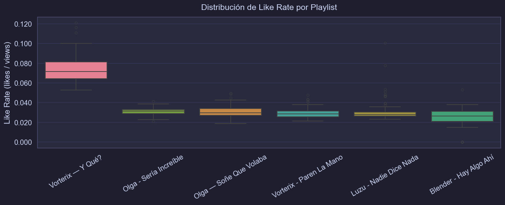
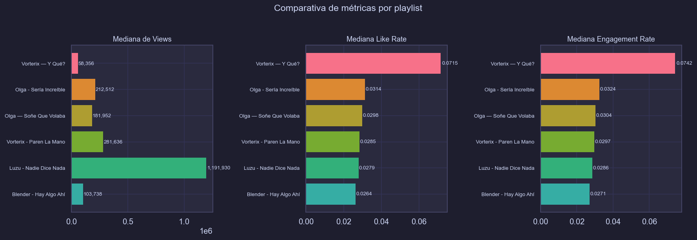
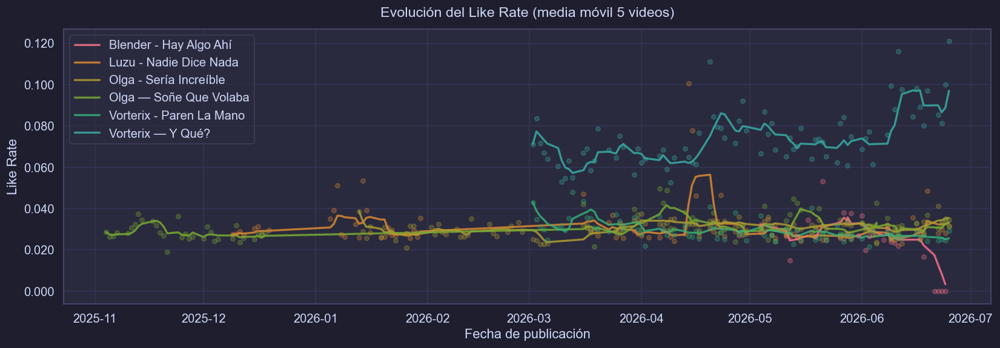
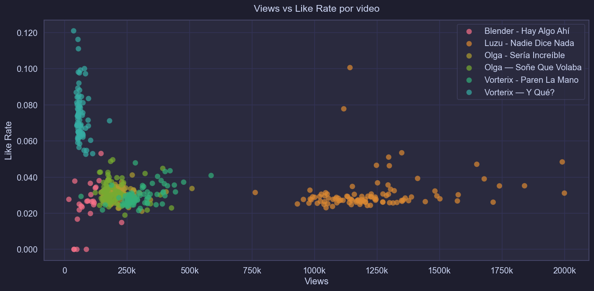
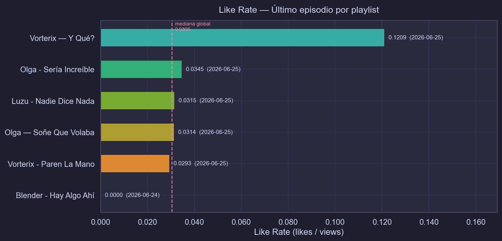

# 📺 YouTube Streaming Analytics

Análisis comparativo de métricas de engagement para múltiples canales/programas de stream.

    *** Reporte basado en la consulta hecha el 2026-06-25 22:40 ***
    ✓ Datos cargados: 485 videos de 6 playlists
      Período: 2025-11-04 → 2026-06-25
    

<table border="1" class="dataframe">
  <thead>
    <tr style="text-align: right;">
      <th></th>
      <th>video_id</th>
      <th>title</th>
      <th>channel_title</th>
      <th>published_at</th>
      <th>duration</th>
      <th>duration_seconds</th>
      <th>views</th>
      <th>likes</th>
      <th>comments</th>
      <th>comments_disabled</th>
      <th>playlist_name</th>
      <th>playlist_id</th>
      <th>like_rate</th>
      <th>comment_rate</th>
      <th>engagement_rate</th>
      <th>published_date</th>
    </tr>
  </thead>
  <tbody>
    <tr>
      <th>0</th>
      <td>9J3w6BFPIVA</td>
      <td>QUILOMBO EN DIPUTADOS Y JUEVES DE FILMINAS | #...</td>
      <td>Vorterix</td>
      <td>2026-06-25 17:52:04+00:00</td>
      <td>PT2H44M15S</td>
      <td>9855</td>
      <td>36794</td>
      <td>4450</td>
      <td>84</td>
      <td>False</td>
      <td>Vorterix — Y Qué?</td>
      <td>PLHZOhV2rP0rkZ6VS01vvddeHrr7220LcM</td>
      <td>0.120944</td>
      <td>0.002283</td>
      <td>0.123227</td>
      <td>2026-06-25</td>
    </tr>
    <tr>
      <th>1</th>
      <td>nsCKVWNvlyo</td>
      <td>EL SUPERFESTEJO DEL CUMPLE DE ANACLETA | #YQUE...</td>
      <td>Vorterix</td>
      <td>2026-06-24 17:57:59+00:00</td>
      <td>PT2H44M18S</td>
      <td>9858</td>
      <td>80198</td>
      <td>8023</td>
      <td>327</td>
      <td>False</td>
      <td>Vorterix — Y Qué?</td>
      <td>PLHZOhV2rP0rkZ6VS01vvddeHrr7220LcM</td>
      <td>0.100040</td>
      <td>0.004077</td>
      <td>0.104117</td>
      <td>2026-06-24</td>
    </tr>
    <tr>
      <th>2</th>
      <td>oshTaQM0XTw</td>
      <td>NAVAJA NOS FUE INFIEL CON LULI OFMAN y NOTIFED...</td>
      <td>Vorterix</td>
      <td>2026-06-23 18:03:52+00:00</td>
      <td>PT2H46M12S</td>
      <td>9972</td>
      <td>74313</td>
      <td>6030</td>
      <td>217</td>
      <td>False</td>
      <td>Vorterix — Y Qué?</td>
      <td>PLHZOhV2rP0rkZ6VS01vvddeHrr7220LcM</td>
      <td>0.081143</td>
      <td>0.002920</td>
      <td>0.084063</td>
      <td>2026-06-23</td>
    </tr>
  </tbody>
</table>

---
## 1. Tabla comparativa por playlist

Mediana de views, likes y ratios de engagement para cada programa.

<table id="T_9abfd">
  <caption>Métricas agregadas por playlist (ordenadas por engagement_rate mediana ↓)</caption>
  <thead>
    <tr>
      <th class="blank level0" >&nbsp;</th>
      <th id="T_9abfd_level0_col0" class="col_heading level0 col0" >playlist_name</th>
      <th id="T_9abfd_level0_col1" class="col_heading level0 col1" >video_count</th>
      <th id="T_9abfd_level0_col2" class="col_heading level0 col2" >median_views</th>
      <th id="T_9abfd_level0_col3" class="col_heading level0 col3" >median_likes</th>
      <th id="T_9abfd_level0_col4" class="col_heading level0 col4" >median_like_rate</th>
      <th id="T_9abfd_level0_col5" class="col_heading level0 col5" >median_engagement_rate</th>
      <th id="T_9abfd_level0_col6" class="col_heading level0 col6" >p25_engagement_rate</th>
      <th id="T_9abfd_level0_col7" class="col_heading level0 col7" >p75_engagement_rate</th>
      <th id="T_9abfd_level0_col8" class="col_heading level0 col8" >top_video_title</th>
    </tr>
  </thead>
  <tbody>
    <tr>
      <th id="T_9abfd_level0_row0" class="row_heading level0 row0" >5</th>
      <td id="T_9abfd_row0_col0" class="data row0 col0" >Vorterix — Y Qué?</td>
      <td id="T_9abfd_row0_col1" class="data row0 col1" >80</td>
      <td id="T_9abfd_row0_col2" class="data row0 col2" >58,356</td>
      <td id="T_9abfd_row0_col3" class="data row0 col3" >4,408</td>
      <td id="T_9abfd_row0_col4" class="data row0 col4" >0.0715</td>
      <td id="T_9abfd_row0_col5" class="data row0 col5" >0.0742</td>
      <td id="T_9abfd_row0_col6" class="data row0 col6" >0.0677</td>
      <td id="T_9abfd_row0_col7" class="data row0 col7" >0.0843</td>
      <td id="T_9abfd_row0_col8" class="data row0 col8" >QUILOMBO EN DIPUTADOS Y JUEVES DE FILMINAS | #YQUE COMPLETO 25/6 | VORTERIX</td>
    </tr>
    <tr>
      <th id="T_9abfd_level0_row1" class="row_heading level0 row1" >2</th>
      <td id="T_9abfd_row1_col0" class="data row1 col0" >Olga - Sería Increíble</td>
      <td id="T_9abfd_row1_col1" class="data row1 col1" >100</td>
      <td id="T_9abfd_row1_col2" class="data row1 col2" >212,512</td>
      <td id="T_9abfd_row1_col3" class="data row1 col3" >6,584</td>
      <td id="T_9abfd_row1_col4" class="data row1 col4" >0.0314</td>
      <td id="T_9abfd_row1_col5" class="data row1 col5" >0.0324</td>
      <td id="T_9abfd_row1_col6" class="data row1 col6" >0.0300</td>
      <td id="T_9abfd_row1_col7" class="data row1 col7" >0.0340</td>
      <td id="T_9abfd_row1_col8" class="data row1 col8" >¡10 AÑOS DESPUÉS! Vero LOZANO y Leo MONTERO VUELVEN en #SeríaIncreíble 22/6</td>
    </tr>
    <tr>
      <th id="T_9abfd_level0_row2" class="row_heading level0 row2" >3</th>
      <td id="T_9abfd_row2_col0" class="data row2 col0" >Olga — Soñe Que Volaba</td>
      <td id="T_9abfd_row2_col1" class="data row2 col1" >100</td>
      <td id="T_9abfd_row2_col2" class="data row2 col2" >181,952</td>
      <td id="T_9abfd_row2_col3" class="data row2 col3" >5,793</td>
      <td id="T_9abfd_row2_col4" class="data row2 col4" >0.0298</td>
      <td id="T_9abfd_row2_col5" class="data row2 col5" >0.0304</td>
      <td id="T_9abfd_row2_col6" class="data row2 col6" >0.0279</td>
      <td id="T_9abfd_row2_col7" class="data row2 col7" >0.0346</td>
      <td id="T_9abfd_row2_col8" class="data row2 col8" >MIGUE y HOMERO GUARDAN su SECRETO en la LUNA | #SoñéQueVolaba 6/4</td>
    </tr>
    <tr>
      <th id="T_9abfd_level0_row3" class="row_heading level0 row3" >4</th>
      <td id="T_9abfd_row3_col0" class="data row3 col0" >Vorterix - Paren La Mano</td>
      <td id="T_9abfd_row3_col1" class="data row3 col1" >78</td>
      <td id="T_9abfd_row3_col2" class="data row3 col2" >281,636</td>
      <td id="T_9abfd_row3_col3" class="data row3 col3" >7,891</td>
      <td id="T_9abfd_row3_col4" class="data row3 col4" >0.0285</td>
      <td id="T_9abfd_row3_col5" class="data row3 col5" >0.0297</td>
      <td id="T_9abfd_row3_col6" class="data row3 col6" >0.0268</td>
      <td id="T_9abfd_row3_col7" class="data row3 col7" >0.0329</td>
      <td id="T_9abfd_row3_col8" class="data row3 col8" >VIERNES DE BLACKJACK CON DIEGO DIAZ | #ParenLaMano Completo - 13/03 | VORTERIX</td>
    </tr>
    <tr>
      <th id="T_9abfd_level0_row4" class="row_heading level0 row4" >1</th>
      <td id="T_9abfd_row4_col0" class="data row4 col0" >Luzu - Nadie Dice Nada</td>
      <td id="T_9abfd_row4_col1" class="data row4 col1" >100</td>
      <td id="T_9abfd_row4_col2" class="data row4 col2" >1,191,930</td>
      <td id="T_9abfd_row4_col3" class="data row4 col3" >33,250</td>
      <td id="T_9abfd_row4_col4" class="data row4 col4" >0.0279</td>
      <td id="T_9abfd_row4_col5" class="data row4 col5" >0.0286</td>
      <td id="T_9abfd_row4_col6" class="data row4 col6" >0.0270</td>
      <td id="T_9abfd_row4_col7" class="data row4 col7" >0.0313</td>
      <td id="T_9abfd_row4_col8" class="data row4 col8" >#NADIEDICENADA | UN NUEVO MOMI A CIEGAS, CONOCEMOS A CARLOS SOÚL Y ¿SANTI NO PONE LÍMITES?  </td>
    </tr>
    <tr>
      <th id="T_9abfd_level0_row5" class="row_heading level0 row5" >0</th>
      <td id="T_9abfd_row5_col0" class="data row5 col0" >Blender - Hay Algo Ahí</td>
      <td id="T_9abfd_row5_col1" class="data row5 col1" >27</td>
      <td id="T_9abfd_row5_col2" class="data row5 col2" >103,738</td>
      <td id="T_9abfd_row5_col3" class="data row5 col3" >2,510</td>
      <td id="T_9abfd_row5_col4" class="data row5 col4" >0.0264</td>
      <td id="T_9abfd_row5_col5" class="data row5 col5" >0.0271</td>
      <td id="T_9abfd_row5_col6" class="data row5 col6" >0.0215</td>
      <td id="T_9abfd_row5_col7" class="data row5 col7" >0.0325</td>
      <td id="T_9abfd_row5_col8" class="data row5 col8" >HISTÓRICA SALA DE SITUABORD con MILEI DESATADO en TODOS LOS AUDIOS FILTRADOS | HAY ALGO AHÍ</td>
    </tr>
  </tbody>
</table>

---
## 2. Distribución de Like Rate por playlist

Boxplot que muestra la mediana, dispersión e outliers de cada programa.

    

    

---
## 3. Comparativa directa de medianas — Barras

    

    

---
## 4. Evolución temporal — Like Rate a lo largo del tiempo

Muestra cómo evoluciona el engagement de cada programa según la fecha de publicación.

    

    

---
## 5. Top 10 videos por engagement rate (global)

<table id="T_130db">
  <caption>🏆 Top 10 videos por engagement rate</caption>
  <thead>
    <tr>
      <th class="blank level0" >&nbsp;</th>
      <th id="T_130db_level0_col0" class="col_heading level0 col0" >playlist_name</th>
      <th id="T_130db_level0_col1" class="col_heading level0 col1" >title</th>
      <th id="T_130db_level0_col2" class="col_heading level0 col2" >published_date</th>
      <th id="T_130db_level0_col3" class="col_heading level0 col3" >views</th>
      <th id="T_130db_level0_col4" class="col_heading level0 col4" >likes</th>
      <th id="T_130db_level0_col5" class="col_heading level0 col5" >comments</th>
      <th id="T_130db_level0_col6" class="col_heading level0 col6" >like_rate</th>
      <th id="T_130db_level0_col7" class="col_heading level0 col7" >engagement_rate</th>
    </tr>
  </thead>
  <tbody>
    <tr>
      <th id="T_130db_level0_row0" class="row_heading level0 row0" >1</th>
      <td id="T_130db_row0_col0" class="data row0 col0" >Vorterix — Y Qué?</td>
      <td id="T_130db_row0_col1" class="data row0 col1" >QUILOMBO EN DIPUTADOS Y JUEVES DE FILMINAS | #YQUE COMPLETO 25/6 | VORTERIX</td>
      <td id="T_130db_row0_col2" class="data row0 col2" >2026-06-25 00:00:00</td>
      <td id="T_130db_row0_col3" class="data row0 col3" >36,794</td>
      <td id="T_130db_row0_col4" class="data row0 col4" >4,450</td>
      <td id="T_130db_row0_col5" class="data row0 col5" >84</td>
      <td id="T_130db_row0_col6" class="data row0 col6" >0.1209</td>
      <td id="T_130db_row0_col7" class="data row0 col7" >0.1232</td>
    </tr>
    <tr>
      <th id="T_130db_level0_row1" class="row_heading level0 row1" >2</th>
      <td id="T_130db_row1_col0" class="data row1 col0" >Vorterix — Y Qué?</td>
      <td id="T_130db_row1_col1" class="data row1 col1" >EMPATÍA CON ADORNI Y SUS BITCOIN CARAY | #YQUE COMPLETO 11/6 | VORTERIX</td>
      <td id="T_130db_row1_col2" class="data row1 col2" >2026-06-11 00:00:00</td>
      <td id="T_130db_row1_col3" class="data row1 col3" >54,141</td>
      <td id="T_130db_row1_col4" class="data row1 col4" >6,291</td>
      <td id="T_130db_row1_col5" class="data row1 col5" >123</td>
      <td id="T_130db_row1_col6" class="data row1 col6" >0.1162</td>
      <td id="T_130db_row1_col7" class="data row1 col7" >0.1185</td>
    </tr>
    <tr>
      <th id="T_130db_level0_row2" class="row_heading level0 row2" >3</th>
      <td id="T_130db_row2_col0" class="data row2 col0" >Vorterix — Y Qué?</td>
      <td id="T_130db_row2_col1" class="data row2 col1" >LA RAVE RELIGIOSA, NOTIFEDERAL Y GUILLE PRÓCER | #YQUE COMPLETO 20/04 | VORTERIX</td>
      <td id="T_130db_row2_col2" class="data row2 col2" >2026-04-20 00:00:00</td>
      <td id="T_130db_row2_col3" class="data row2 col3" >55,862</td>
      <td id="T_130db_row2_col4" class="data row2 col4" >6,202</td>
      <td id="T_130db_row2_col5" class="data row2 col5" >394</td>
      <td id="T_130db_row2_col6" class="data row2 col6" >0.1110</td>
      <td id="T_130db_row2_col7" class="data row2 col7" >0.1181</td>
    </tr>
    <tr>
      <th id="T_130db_level0_row3" class="row_heading level0 row3" >4</th>
      <td id="T_130db_row3_col0" class="data row3 col0" >Vorterix — Y Qué?</td>
      <td id="T_130db_row3_col1" class="data row3 col1" >EL SUPERFESTEJO DEL CUMPLE DE ANACLETA | #YQUE COMPLETO 24/6 | VORTERIX</td>
      <td id="T_130db_row3_col2" class="data row3 col2" >2026-06-24 00:00:00</td>
      <td id="T_130db_row3_col3" class="data row3 col3" >80,198</td>
      <td id="T_130db_row3_col4" class="data row3 col4" >8,023</td>
      <td id="T_130db_row3_col5" class="data row3 col5" >327</td>
      <td id="T_130db_row3_col6" class="data row3 col6" >0.1000</td>
      <td id="T_130db_row3_col7" class="data row3 col7" >0.1041</td>
    </tr>
    <tr>
      <th id="T_130db_level0_row4" class="row_heading level0 row4" >5</th>
      <td id="T_130db_row4_col0" class="data row4 col0" >Vorterix — Y Qué?</td>
      <td id="T_130db_row4_col1" class="data row4 col1" >RELACIONES ENTRE PRIMOS CON FEDE SIMONETTI | #YQUE COMPLETO 9/6 | VORTERIX</td>
      <td id="T_130db_row4_col2" class="data row4 col2" >2026-06-09 00:00:00</td>
      <td id="T_130db_row4_col3" class="data row4 col3" >64,208</td>
      <td id="T_130db_row4_col4" class="data row4 col4" >6,373</td>
      <td id="T_130db_row4_col5" class="data row4 col5" >275</td>
      <td id="T_130db_row4_col6" class="data row4 col6" >0.0993</td>
      <td id="T_130db_row4_col7" class="data row4 col7" >0.1035</td>
    </tr>
    <tr>
      <th id="T_130db_level0_row5" class="row_heading level0 row5" >6</th>
      <td id="T_130db_row5_col0" class="data row5 col0" >Vorterix — Y Qué?</td>
      <td id="T_130db_row5_col1" class="data row5 col1" >FLOR PEÑA NOS OBLIGÓ A QUE VUELVA EL TOP FIVE | #YQUE COMPLETO 19/06 | VORTERIX</td>
      <td id="T_130db_row5_col2" class="data row5 col2" >2026-06-19 00:00:00</td>
      <td id="T_130db_row5_col3" class="data row5 col3" >84,292</td>
      <td id="T_130db_row5_col4" class="data row5 col4" >8,192</td>
      <td id="T_130db_row5_col5" class="data row5 col5" >397</td>
      <td id="T_130db_row5_col6" class="data row5 col6" >0.0972</td>
      <td id="T_130db_row5_col7" class="data row5 col7" >0.1019</td>
    </tr>
    <tr>
      <th id="T_130db_level0_row6" class="row_heading level0 row6" >7</th>
      <td id="T_130db_row6_col0" class="data row6 col0" >Luzu - Nadie Dice Nada</td>
      <td id="T_130db_row6_col1" class="data row6 col1" >#NADIEDICENADA | UN NUEVO MOMI A CIEGAS, CONOCEMOS A CARLOS SOÚL Y ¿SANTI NO PONE LÍMITES?  </td>
      <td id="T_130db_row6_col2" class="data row6 col2" >2026-04-14 00:00:00</td>
      <td id="T_130db_row6_col3" class="data row6 col3" >1,142,088</td>
      <td id="T_130db_row6_col4" class="data row6 col4" >114,903</td>
      <td id="T_130db_row6_col5" class="data row6 col5" >1454</td>
      <td id="T_130db_row6_col6" class="data row6 col6" >0.1006</td>
      <td id="T_130db_row6_col7" class="data row6 col7" >0.1019</td>
    </tr>
    <tr>
      <th id="T_130db_level0_row7" class="row_heading level0 row7" >8</th>
      <td id="T_130db_row7_col0" class="data row7 col0" >Vorterix — Y Qué?</td>
      <td id="T_130db_row7_col1" class="data row7 col1" >FIEBRE MUNDIALISTA Y EL GRAN JUEGO DE TROLLÍN | #YQUE COMPLETO 16/6 | VORTERIX</td>
      <td id="T_130db_row7_col2" class="data row7 col2" >2026-06-16 00:00:00</td>
      <td id="T_130db_row7_col3" class="data row7 col3" >55,479</td>
      <td id="T_130db_row7_col4" class="data row7 col4" >5,444</td>
      <td id="T_130db_row7_col5" class="data row7 col5" >138</td>
      <td id="T_130db_row7_col6" class="data row7 col6" >0.0981</td>
      <td id="T_130db_row7_col7" class="data row7 col7" >0.1006</td>
    </tr>
    <tr>
      <th id="T_130db_level0_row8" class="row_heading level0 row8" >9</th>
      <td id="T_130db_row8_col0" class="data row8 col0" >Vorterix — Y Qué?</td>
      <td id="T_130db_row8_col1" class="data row8 col1" >VINO JULIETA PINK Y DESAPARECIÓ TROLLÍN... | #YQUE COMPLETO 12/6 | VORTERIX</td>
      <td id="T_130db_row8_col2" class="data row8 col2" >2026-06-12 00:00:00</td>
      <td id="T_130db_row8_col3" class="data row8 col3" >60,043</td>
      <td id="T_130db_row8_col4" class="data row8 col4" >5,863</td>
      <td id="T_130db_row8_col5" class="data row8 col5" >143</td>
      <td id="T_130db_row8_col6" class="data row8 col6" >0.0976</td>
      <td id="T_130db_row8_col7" class="data row8 col7" >0.1000</td>
    </tr>
    <tr>
      <th id="T_130db_level0_row9" class="row_heading level0 row9" >10</th>
      <td id="T_130db_row9_col0" class="data row9 col0" >Vorterix — Y Qué?</td>
      <td id="T_130db_row9_col1" class="data row9 col1" >SE VIENE EL APOCALIPSIS Y CONOCIMOS NOVIOS CURIOSOS | #YQUE COMPLETO 29/04 | VORTERIX</td>
      <td id="T_130db_row9_col2" class="data row9 col2" >2026-04-29 00:00:00</td>
      <td id="T_130db_row9_col3" class="data row9 col3" >57,780</td>
      <td id="T_130db_row9_col4" class="data row9 col4" >5,317</td>
      <td id="T_130db_row9_col5" class="data row9 col5" >175</td>
      <td id="T_130db_row9_col6" class="data row9 col6" >0.0920</td>
      <td id="T_130db_row9_col7" class="data row9 col7" >0.0951</td>
    </tr>
  </tbody>
</table>

---
## 6. Scatter: Views vs Like Rate por playlist

¿Los videos más vistos tienen mejor o peor engagement?

    

    

---
## 7. Último episodio de cada playlist — Like Rate comparativo

Comparación del like_rate del **episodio más reciente** disponible de cada programa.
La línea punteada muestra la mediana global como referencia.

    

    

    
    Resumen — último episodio por playlist:
    

<table border="1" class="dataframe">
  <thead>
    <tr style="text-align: right;">
      <th></th>
      <th>playlist_name</th>
      <th>title</th>
      <th>published_date</th>
      <th>views</th>
      <th>likes</th>
      <th>like_rate</th>
    </tr>
  </thead>
  <tbody>
    <tr>
      <th>1</th>
      <td>Vorterix — Y Qué?</td>
      <td>QUILOMBO EN DIPUTADOS Y JUEVES DE FILMINAS | #...</td>
      <td>2026-06-25</td>
      <td>36,794</td>
      <td>4,450</td>
      <td>0.1209</td>
    </tr>
    <tr>
      <th>2</th>
      <td>Olga - Sería Increíble</td>
      <td>VERO y LEO se VUELVEN a VER con BARASSI y LUSS...</td>
      <td>2026-06-25</td>
      <td>230,084</td>
      <td>7,946</td>
      <td>0.0345</td>
    </tr>
    <tr>
      <th>3</th>
      <td>Luzu - Nadie Dice Nada</td>
      <td>#NADIEDICENADA l EL PSICÓLOGO DE MARTIN JUEGA ...</td>
      <td>2026-06-25</td>
      <td>763,143</td>
      <td>24,013</td>
      <td>0.0315</td>
    </tr>
    <tr>
      <th>4</th>
      <td>Olga — Soñe Que Volaba</td>
      <td>SINCERIDAD SIN EMPATÍA ES CRUELDAD (estaban re...</td>
      <td>2026-06-25</td>
      <td>123,095</td>
      <td>3,862</td>
      <td>0.0314</td>
    </tr>
    <tr>
      <th>5</th>
      <td>Vorterix - Paren La Mano</td>
      <td>UTOPIAS IMPOSIBLES Y EL CONSULTORIO DE EDUL | ...</td>
      <td>2026-06-25</td>
      <td>66,485</td>
      <td>1,948</td>
      <td>0.0293</td>
    </tr>
    <tr>
      <th>6</th>
      <td>Blender - Hay Algo Ahí</td>
      <td>MIÉRCOLES de PUCHOS HISTÓRICO sobre COMEPECADO...</td>
      <td>2026-06-24</td>
      <td>49,868</td>
      <td>0</td>
      <td>0.0000</td>
    </tr>
  </tbody>
</table>

